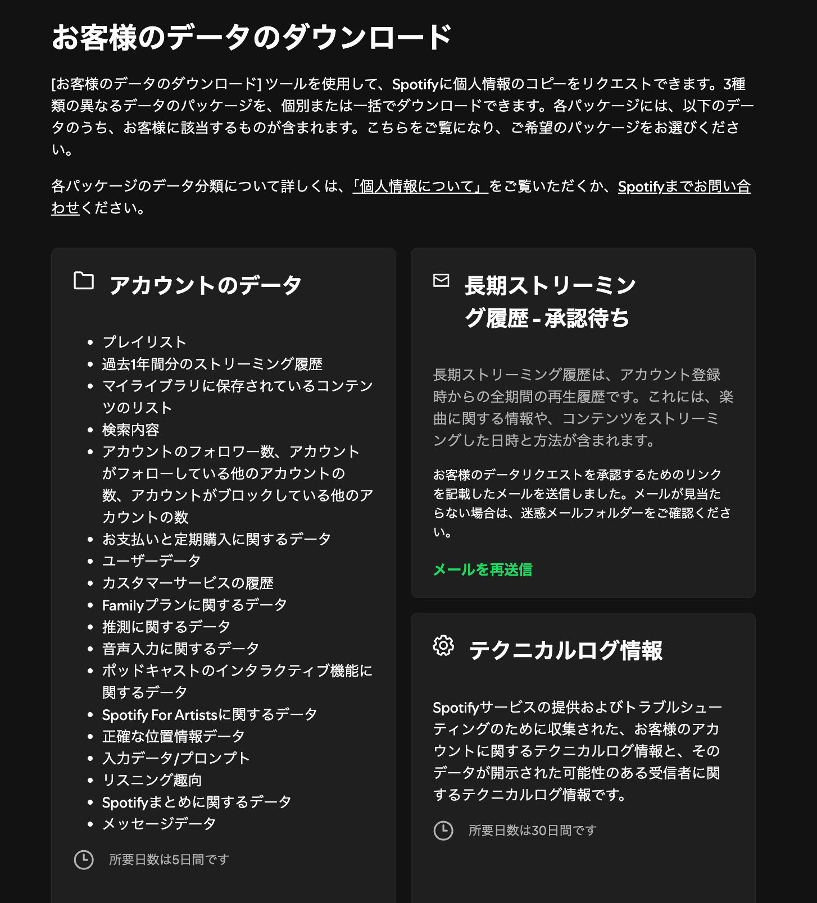
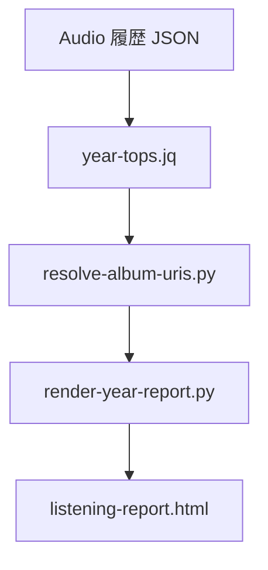

# Spotify recap

Extended Streaming History を年ごとに集計し、曲・アーティスト・アルバムの Top を HTML にする。

このリポジトリの `Streaming_History_Audio_*.json` は **各 100 件のサンプル**。本番の全件は手元に置き、レポート生成は全件に対して行う。

## 事前準備

入力は Spotify アカウントの **長期ストリーミング履歴**（Extended Streaming History）である。過去 1 年分だけ入っている「アカウントのデータ」では足りない。

1. Spotify にログインし、[アカウントのプライバシー](https://www.spotify.com/jp/account/privacy/) を開く
2. 「お客様のデータのダウンロード」で **長期ストリーミング履歴** を申請する（下図の右上）
3. 承認用のメールが届く。リンクを開いてリクエストを承認する。届かないときは迷惑メールを確認するか、画面の「メールを再送信」を使う
4. 承認後、パッケージの準備を待つ。ダウンロード可能になったら ZIP を取得して展開する
5. 展開先の `Streaming_History_Audio_*.json` を、レポートを出すディレクトリに置く。`Streaming_History_Video_*.json` は使わない



図の 3 パッケージの違い:

| パッケージ | この集計で使うか | 内容 |
|---|---|---|
| アカウントのデータ | 使わない | プレイリストや **過去 1 年分** のストリーミング履歴など。所要目安 5 日 |
| **長期ストリーミング履歴** | **使う** | アカウント登録時からの全期間の再生履歴。曲の情報、再生した日時と方法。申請後にメール承認が必要 |
| テクニカルログ情報 | 使わない | トラブルシューティング用。所要目安 30 日 |

ZIP には `ReadMeFirst_ExtendedStreamingHistory.pdf` も入る。各 Audio JSON は再生 1 回が 1 レコードで、`ts`・`ms_played`・`spotify_track_uri`・アルバム / アーティスト名などが含まれる。アルバム URI は無い。

## 必要コマンド

- `jq`
- `python3`（標準ライブラリのみ）
- アルバムページのリンクを付けるときだけ Spotify Web API（Client Credentials）

## レポートを作る

```bash
cp .env.sample .env   # Client ID / Secret を埋める
scripts/make-year-report.sh
```

出力は `listening-report.html`。オプション:

```bash
scripts/make-year-report.sh --tracks 50 --artists 50 --albums 30 --out listening-report.html
```

入力はプロジェクト直下の `Streaming_History_Audio_*.json` すべて。年の分割はファイル名ではなく、各レコードの `ts` の西暦。

## パイプライン

[`make-year-report.sh`](scripts/make-year-report.sh) は次の 3 段をパイプする。集計ルールはここ以外に散らさない。



各段の役割は [scripts](#scripts) を参照。

## scripts

### [`make-year-report.sh`](scripts/make-year-report.sh)

エントリポイント。上記パイプを組むだけ。集計ロジックは持たない。

### [`year-tops.jq`](scripts/year-tops.jq)

本番の集計。`jq -s` で全 Audio JSON を連結してから年ブロックを作る。

| 対象 | キー | Top |
|---|---|---|
| 曲 | `spotify_track_uri` | 50 |
| アーティスト | `master_metadata_album_artist_name` | 50 |
| アルバム | アーティスト名 × アルバム名 | 30 |

共通ルール:

1. `spotify_track_uri` がある再生だけ（Podcast / オーディオブック除外）
2. 主指標は再生回数（レコード件数）。`skipped` や短時間再生も 1 回
3. 同点は `ms_played` 合計の降順、その後 URI / 名前の昇順
4. アルバム行の `uri` は、そのアルバムで最多再生の曲 URI（アルバム ID は履歴に無いため）
5. 2023 年だけ `Relax α Wave` と `α Healing` を順位から除外。`meta.excluded_*` には残す

### [`resolve-album-uris.py`](scripts/resolve-album-uris.py)

stdin の年次 JSON を読み、各アルバムに `album_uri`（`spotify:album:…`）を足して stdout へ出す。

- [Get Track](https://developer.spotify.com/documentation/web-api/reference/get-track) `GET /v1/tracks/{id}?market=JP`
- 認証は Client Credentials。`.env` の `SPOTIFY_CLIENT_ID` / `SPOTIFY_CLIENT_SECRET`
- Development Mode では一括 `GET /tracks?ids=` は使わない（曲ごとに Get Track）
- Spotify Soloist API Key は使えない
- 結果は `.spotify-album-cache.json`（gitignore）。キャッシュが揃っていれば資格情報は不要
- 解決できないときは HTML 側が代表曲の track URL に落とす

### [`render-year-report.py`](scripts/render-year-report.py)

年次 JSON → 単一 HTML。ネットワークしない。

- 曲名 → `https://open.spotify.com/track/{id}`
- アルバム名 → `album_uri` があれば `/album/{id}`、なければ代表曲

### [`top-listens.sh`](scripts/top-listens.sh)

ファイル指定の簡易 Top N。年分割もアルバムも HTML も無い。ルールの元になった探索用スクリプトで、`year-tops.jq` の曲・アーティスト集計と同じ考え方。

```bash
scripts/top-listens.sh Streaming_History_Audio_2024.json
scripts/top-listens.sh --limit 20 --json Streaming_History_Audio_*.json
```

## 認証

1. [Dashboard](https://developer.spotify.com/dashboard) で **アプリ** を作る（Soloist API Key ではない）
2. Redirect URI は Client Credentials では使わない。必須なら `http://127.0.0.1:3000`
3. `.env.sample` を `.env` にコピーして Client ID / Secret を入れる

`.env` はコミットしない。
